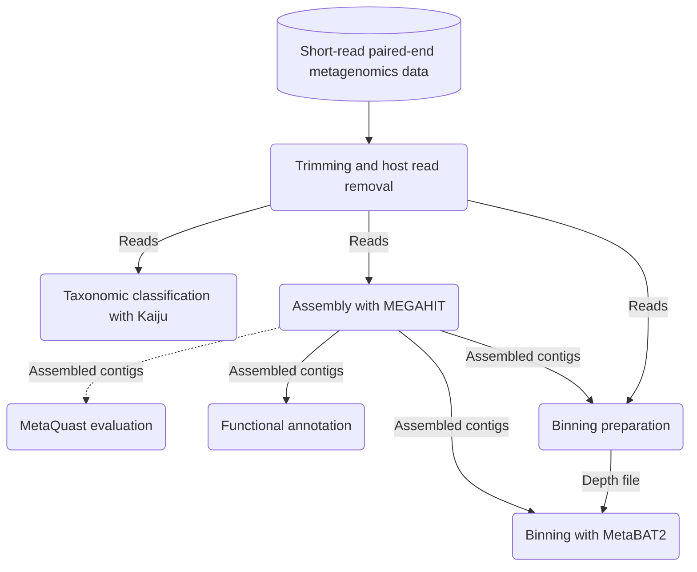

## metamage

metamage is a workflow for taxonomic classification, assembly, binning
and annotation of short-read host-associated metagenomics datasets.

It's composed of:

## Read pre-processing and host read removal

- [fastp](https://github.com/OpenGene/fastp) for read trimming
  and other general pre-processing [^9]
- [BowTie2](https://github.com/BenLangmead/bowtie2) for mapping
  to the host genome and extracting unaligned reads [^10]

## Assembly

- [MEGAHIT](https://github.com/voutcn/megahit) for assembly [^1]
- [MetaQuast](https://github.com/ablab/quast) for assembly evaluation

## Functional annotation

- [Macrel](https://github.com/BigDataBiology/macrel) for predicting Antimicrobial Peptide
  (AMP)-like sequences from contigs [^6]
- [fARGene](https://github.com/fannyhb/fargene) for identifying Antimicrobial Resistance Genes
  (ARGs) from contigs [^7]
- [Gecco](https://github.com/zellerlab/GECCO) for predicting biosynthetic gene clusters
  (BCGs) from contigs [^8]
- [Prodigal](https://github.com/hyattpd/Prodigal) for protein-coding
  gene prediction from contigs. [^5]

## Binning

- BowTie2 and [Samtools](https://github.com/samtools/samtools)[^11] to
  building depth files for binning.
- [MetaBAT2](https://bitbucket.org/berkeleylab/metabat/src/master/) for
  binning [^2]

## Taxonomic classification of reads

- [Kaiju](https://github.com/bioinformatics-centre/kaiju) for
  taxonomic classification [^3]
- [KronaTools](https://github.com/marbl/Krona/wiki/KronaTools) for
  visualizing taxonomic classification results

## Where to get the data?

- Kaiju indexes can be generated based on a reference database but
  you can also find some pre-built ones in the sidebar of the
  [Kaiju website](https://kaiju.binf.ku.dk/server).

- Reference host genomes can be acquired from a variety of databases,
  for example [Ensembl](https://www.ensembl.org/index.html).

[^1]: Li, D., Luo, R., Liu, C.M., Leung, C.M., Ting, H.F., Sadakane, K., Yamashita, H. and Lam, T.W., 2016. MEGAHIT v1.0: A Fast and Scalable Metagenome Assembler driven by Advanced Methodologies and Community Practices. Methods.
[^2]:
    Alla Mikheenko, Vladislav Saveliev, Alexey Gurevich,
    MetaQUAST: evaluation of metagenome assemblies,
    Bioinformatics (2016) 32 (7): 1088-1090. doi: 10.1093/bioinformatics/btv697

[^3]:
    Kang DD, Li F, Kirton E, Thomas A, Egan R, An H, Wang Z. 2019. MetaBAT 2: an
    adaptive binning algorithm for robust and efficient genome reconstruction
    from metagenome assemblies. PeerJ 7:e7359 https://doi.org/10.7717/peerj.7359

[^4]:
    Menzel, P., Ng, K. & Krogh, A. Fast and sensitive taxonomic classification for
    metagenomics with Kaiju. Nat Commun 7, 11257 (2016).
    https://doi.org/10.1038/ncomms11257

[^5]:
    Hyatt, D., Chen, GL., LoCascio, P.F. et al. Prodigal: prokaryotic gene recognition
    and translation initiation site identification.
    BMC Bioinformatics 11, 119 (2010). https://doi.org/10.1186/1471-2105-11-119

[^6]:
    Santos-Júnior CD, Pan S, Zhao X, Coelho LP. 2020.
    Macrel: antimicrobial peptide screening in genomes and metagenomes.
    PeerJ 8:e10555. DOI: 10.7717/peerj.10555

[^7]:
    Berglund, F., Österlund, T., Boulund, F., Marathe, N. P.,
    Larsson, D. J., & Kristiansson, E. (2019).
    Identification and reconstruction of novel antibiotic resistance genes
    from metagenomes. Microbiome, 7(1), 52.

[^8]:
    Accurate de novo identification of biosynthetic gene clusters with GECCO.
    Laura M Carroll, Martin Larralde, Jonas Simon Fleck, Ruby Ponnudurai,
    Alessio Milanese, Elisa Cappio Barazzone, Georg Zeller.
    bioRxiv 2021.05.03.442509; doi:10.1101/2021.05.03.442509

[^9]:
    Shifu Chen, Yanqing Zhou, Yaru Chen, Jia Gu;
    fastp: an ultra-fast all-in-one FASTQ preprocessor,
    Bioinformatics, Volume 34, Issue 17, 1 September 2018,
    Pages i884–i890, https://doi.org/10.1093/bioinformatics/bty560

[^10]:
    Langmead B, Wilks C., Antonescu V., Charles R. Scaling read
    aligners to hundreds of threads on general-purpose processors.
    Bioinformatics. bty648.

[^11]:
    Twelve years of SAMtools and BCFtools
    Petr Danecek, James K Bonfield, Jennifer Liddle, John Marshall,
    Valeriu Ohan, Martin O Pollard, Andrew Whitwham, Thomas Keane, Shane A McCarthy,
    Robert M Davies, Heng Li
    GigaScience, Volume 10, Issue 2, February 2021, giab008,
    https://doi.org/10.1093/gigascience/giab008
